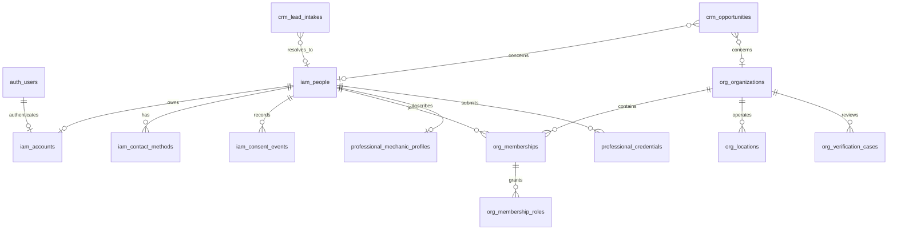

# Phase 1: Identity, native CRM, and organizations

## Ownership and relationships

MotorBaldi owns business identity and CRM in D1. Better Auth owns passwords, sessions, MFA secrets, and technical login email. `iam_accounts.id` is the technical user ID and references one canonical `iam_people` row. People can exist without accounts; organizations never authenticate. A verified technical user is reconciled through `ensureMotorBaldiAccount` on principal resolution and on the background schedule. Reconciliation uses guarded D1 inserts and can recover a missing business account without making another person.

Domain packages `identity`, `organizations`, `professional`, and `crm` expose public APIs. Apps use these APIs and central `authz`; packages never import apps. No CRM contacts table duplicates people. `crm_lead_intakes` keeps anonymous submissions separate from reviewed people. Names or phones alone never trigger person merge. Duplicate candidates require staff review. Merge retains the source as `MERGED` and moves Phase 1 relationships while preserving audit records and prior authorship.

## Authorization

Default deny is enforced by the API and domain services. Organization permissions combine active person membership, assigned roles, organization state, and location scope. A selected workspace is only presentation context. The owner role grants ownership management; the admin role lacks ownership grants. D1 triggers prevent removal, suspension, or offboarding of the last active owner. Platform roles attach to people separately from organization memberships. Sensitive platform decisions require central permission, a verified TOTP factor, and a session created after factor enrollment. Staff must sign in again after enabling TOTP. A person merge revokes source platform roles; platform privilege never transfers through the merge. Admin Service Binding traffic conveys no privileged trust by itself.

## State transitions

| Aggregate                 | From                     | Command                              | To                                     | Authority                                            |
| ------------------------- | ------------------------ | ------------------------------------ | -------------------------------------- | ---------------------------------------------------- |
| Account                   | active                   | suspend                              | suspended                              | platform account permission and MFA                  |
| Invitation                | pending                  | accept, revoke, expiry               | accepted, revoked, expired             | matching verified email; authorized org member; time |
| Membership request        | pending                  | approve, reject, cancel, expiry      | approved, rejected, cancelled, expired | same-org reviewer; same person; time                 |
| Organization verification | draft, needs information | submit                               | pending verification                   | authorized org member                                |
| Organization verification | pending verification     | start review                         | under review                           | platform verifier                                    |
| Organization verification | under review             | request information, approve, reject | needs information, verified, rejected  | platform verifier and MFA for decision               |
| Organization verification | verified                 | suspend                              | suspended                              | platform staff                                       |
| Professional credential   | unverified, pending      | verify, reject                       | verified, rejected                     | platform verifier and MFA                            |
| CRM lead                  | received                 | triage, reject, mark spam            | triaged, rejected, spam                | CRM staff                                            |
| CRM lead                  | received, triaged        | convert                              | converted                              | CRM staff                                            |

Each controlled transition has a command service. General PATCH routes cannot set controlled statuses. Invitation and membership request decisions are one-time; command replay uses the Foundation Durable Object idempotency coordinator where registered. Organization creation, invite creation, membership request approval, verification decisions, lead receipt and conversion use transactional outbox events with versioned types and minimal ID payloads. Queue consumers are idempotent and do not claim email delivery.

## API and privacy

Phase 1 extends `/api/v1` for current user, organization, Admin, and public lead intake. Request schemas are strict and large lists are bounded. Mutable profile, organization, location, task, and opportunity updates carry versions. OpenAPI is generated from the API contract source. The public lead endpoint uses Turnstile remotely, rate limiting, request size validation, generic receipts, and idempotency. Person search is staff-only.

Data classification: public organization display fields may be PUBLIC after verification; internal status and workflow data are INTERNAL; contact addresses, phones, CRM notes, and professional evidence metadata are CONFIDENTIAL; private verification files and auth/session/MFA secrets are RESTRICTED. R2 remains private, and evidence access resolves an ACTIVE file through an authorized organization or staff route. Outbox payloads use IDs rather than private content. CRM activities are a business timeline, separate from append-only security audit.

## Operating limits

Phase 1.1 closeout keeps `0001_foundation.sql` and `0002_phase1.sql` immutable. Migration `0003_phase1_closeout.sql` grants ADMIN non-owner role management and adds bounded expiration indexes. Authenticated business mutations require an exact trusted browser Origin. Self-requested membership roles are limited to MECHANIC and INSPECTOR. Scheduled maintenance expires pending invitations and requests and elapsed professional credentials. Identity reconciliation records duplicate candidates from email evidence for staff review without merging people.

Remote public signup remains disabled until a production email sender and approved Turnstile workflow are configured. Local tests use the email sink; no remote delivery is claimed. Password recovery and automated invitation delivery also require a future email provider. Remote resources and IDs are manually configured by an operator. No vehicles, service operations, billing, or partner operations exist in Phase 1.
